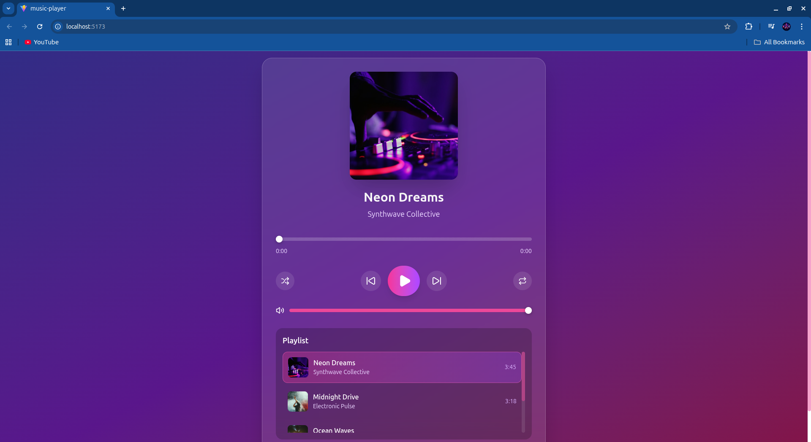

# 🎵 React Music Player

A modern, fully-featured music player built with React, TypeScript, Tailwind CSS, and Vite. Features a beautiful glassmorphism UI design with complete audio playback controls, shuffle, repeat modes, volume control, and a responsive playlist.

## 🎨 Screenshot



Add your screenshot here by saving a screenshot to this directory.

## ✨ Features

- **Play/Pause Controls** - Start and pause audio playback with a single click
- **Skip Navigation** - Navigate forward and backward through your playlist
- **Progress Bar** - Visual feedback on playback progress with seek functionality
- **Volume Control** - Adjust volume level from 0-100% with mute toggle
- **Shuffle Mode** - Randomize song selection while playing
- **Repeat Modes** - Three repeat options: off, repeat all, or repeat one
- **Playlist Management** - Browse and select songs from a scrollable playlist
- **Album Artwork** - Display beautiful album cover art with hover effects
- **Responsive Design** - Glassmorphism UI that works beautifully on all screen sizes
- **Real-time Display** - Live updates for current time, duration, and playback status

## 🛠️ Technology Stack

- **React 19** - Modern UI library with hooks
- **TypeScript** - Type-safe JavaScript for better development experience
- **Tailwind CSS v4** - Utility-first CSS framework with new linear gradient syntax
- **Vite** - Lightning-fast build tool and development server
- **Lucide React** - Beautiful, consistent icon library
- **React Hooks** - Custom `useAudioPlayer` hook for centralized audio state management

## 📦 Installation

1. Clone the repository:

```bash
git clone <repository-url>
cd music-player
```

2. Install dependencies:

```bash
npm install
```

3. Start the development server:

```bash
npm run dev
```

4. Open your browser and navigate to `http://localhost:5174`

## 🏗️ Project Structure

```
src/
├── components/          # Reusable UI components
│   ├── Controls.tsx    # Playback control buttons
│   ├── Player.tsx      # Main player component
│   ├── Playlist.tsx    # Song list display
│   ├── ProgressBar.tsx # Progress slider
│   └── VolumeControl.tsx # Volume slider
├── hooks/
│   └── useAudioPlayer.ts # Custom hook for audio state management
├── data/
│   └── songs.ts        # Sample playlist data
├── types/
│   └── index.ts        # TypeScript interfaces
├── App.tsx             # Main app component
├── main.tsx            # Entry point
└── index.css           # Global styles
```

## 🎮 How It Works

### Custom Audio Hook (`useAudioPlayer`)

The `useAudioPlayer` hook provides a centralized way to manage audio playback:

- **State Management**: Tracks current song index, playback status, time, duration, volume, mute state, shuffle, and repeat mode
- **Audio Element**: Uses the HTML5 Audio API for playback
- **Event Listeners**: Monitors time updates, metadata loading, and end-of-song events
- **Memoized Callbacks**: Uses `useCallback` for optimal performance and dependency management

### Key Components

**Player.tsx** - Main container that displays:

- Album artwork
- Song title and artist
- Progress bar with seek functionality
- Control buttons
- Volume control
- Playlist

**Controls.tsx** - Playback buttons:

- Previous/Play/Next navigation
- Shuffle toggle
- Repeat mode selector

**Playlist.tsx** - Song selection:

- Scrollable list of all songs
- Click to select any song
- Shows duration for each track
- Highlights currently playing song

## 🎯 Usage

### Playing a Song

1. Click the **Play** button to start playback of the current song
2. Use **Previous** and **Next** buttons to navigate the playlist
3. Click on any song in the playlist to jump to it directly

### Adjusting Playback

- **Seek**: Click or drag on the progress bar to jump to any point in the song
- **Volume**: Use the volume slider or click the volume icon to mute/unmute

### Controlling Playback Modes

- **Shuffle**: Click the shuffle button to enable random song selection
- **Repeat**: Cycle through repeat modes:
  - Off (no repeat)
  - All (repeat entire playlist)
  - One (repeat current song)

## 📝 Customization

### Adding Your Own Songs

Edit `src/data/songs.ts` and add new song objects:

```typescript
{
  id: 1,
  title: "Song Title",
  artist: "Artist Name",
  duration: 180, // in seconds
  url: "https://example.com/song.mp3",
  cover: "https://example.com/cover.jpg"
}
```

### Styling

The app uses Tailwind CSS v4 with custom theme colors. Modify colors and styles in component `className` attributes or update `src/index.css`.

## 🚀 Build & Deploy

Build for production:

```bash
npm run build
```

Preview production build:

```bash
npm run preview
```

## �� Linting

Check code quality:

```bash
npm run lint
```

## 📄 License

This project is open source and available under the MIT License.

## 🎓 Learning Resources

- [React Documentation](https://react.dev)
- [TypeScript Documentation](https://www.typescriptlang.org/docs)
- [Tailwind CSS Documentation](https://tailwindcss.com/docs)
- [Vite Documentation](https://vite.dev)
- [HTML5 Audio API](https://developer.mozilla.org/en-US/docs/Web/API/HTMLAudioElement)
